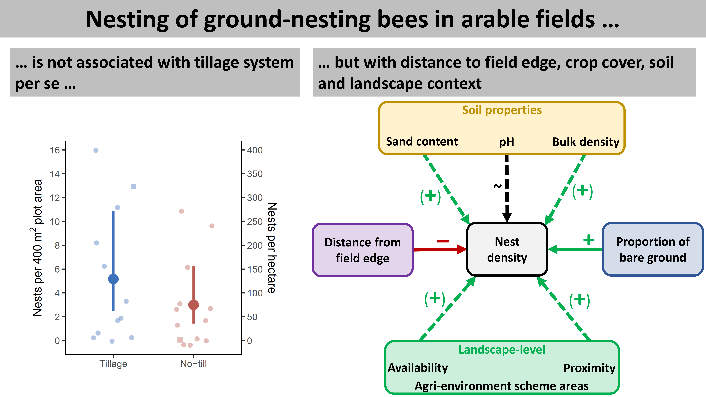

# Code and data for: Tschanz et al. 2023 Journal of Applied Ecology

## About

This repository contains code and data used for the manuscript *Nesting of ground-nesting bees in arable fields is not associated with tillage system per se, but with distance to field edge, crop cover, soil and landscape context* published in [Journal of Applied Ecology](https://besjournals.onlinelibrary.wiley.com/doi/10.1111/1365-2664.14317).

### Graphical Abstract

### Citation

>Tschanz, P., Vogel, S., Walter, A., Keller, T., & Albrecht, M. (2023). Nesting of ground-nesting bees in arable fields is not associated with tillage system per se, but with distance to field edge, crop cover, soil and landscape context. *Journal of Applied Ecology*, 60, 158–169. https://doi.org/10.1111/1365-2664.14317

## Scripts

- `analysis_manuscript.Rmd`: R code used to produce results, figures, and tables shown in the  manuscript
- `analysis_suppInf.Rmd`: R code used to produce results, figures, and tables shown in the supplementary information.
- `functions.R`: R script containing custom build helper functions

## Metadata

All data are available both as `.rds` and as `.csv` files.

### Soil (`soil.rds`)
Data set containing the results of the soil sample analysis for all soil samples used in the statistical analysis. Soil samples were taken directly at the nest and at randomly selected control locations.

- `id`: unique identifier of the soil sample
- `field`: unique identifier of the field
- `mngt_soil`: soil management type (`NT` = no-till, `CT` = conventional tillage)
- `transect`: ID of the belt transect
- `distance`: distance of the belt transect from the field edge in meters
- `type`: whether soil sample was taken at the `Nest` or at randomly selected `Control` locations
- `nest_pa`: `type` but coded as `0` = control and `1` = nest
- `nest_id`: unqiue identifier of the nest
- `soil_bulk_dens`: soil dry bulk density ($g\,cm^{-3}$)
- `soil_rel_dens`: relative soil bulk density (-)
- `soil_som`: soil organic matter content (%)
- `soil_ph`: soil pH (-)
- `soil_sand`: sand content (%)
- `soil_silt`: silt content (%)
- `soil_clay`: clay content (%)

### Vegetation (`vegetation.rds`)

Data set containing the visual estimation of the vegetation assessment within squares (`sqa` = square assessment).

- `id`: unique identifier of the soil sample
- `field`: unique identifier of the field
- `mngt_soil`: soil management type (`NT` = no-till, `CT` = conventional tillage)
- `run`: sampling round
- `type`: whether soil sample was taken at the `Nest` or at randomly selected `Control` locations
- `nest_pa`: `type` but coded as `0` = control and `1` = nest
- `nest_id`: unqiue identifier of the nest
- `scale`: assessment within square of $15\times 15 cm^2$ (`15cm`) or $1\times 1 m^2$ (`1m`)
- `sqa_cov_crop`: crop cover (%)
- `sqa_cov_moss`: moss cover (%)
- `sqa_cov_litter`: litter cover (%)
- `sqa_cov_weed`: weed cover (%)
- `sqa_cov_bare`: bare ground cover (%)
- `sqa_veg_height`: vegetation height (cm)

### Nests (`nests.rds`)

Data set containing all nests found within the eight belt transects:

- `nest_id`: unique identifier of the nest
- `field`: unique identifier of the field
- `mngt_soil`: soil management type (`NT` = no-till, `CT` = conventional tillage)
- `run`: sampling round
- `transect`: ID of the belt transect
- `dist_m`: distance of the belt transect from the field edge in meters
- `tramline` whether the nest was located on a tramline (`yes`) or not (`no`)
- `trap_outcome`: outcome of the trapping effort: no trap installed (`No Attempt`), trap installed but nothing captured (`Fail`), trap installed and nesting female captured (`Success`), trap installed but trap disappeared/destroyed (`Unknown`)
- `nest_species`: scientific species name of the captured female
- `date`: date when the species was found in the trap (`yyyy-mm-dd`)

### Species (`species.rds`)

Data set containing all species captured in the nest. Contains captures from within the belt transects but also from captures outside the belt transects (see `transect`):

- `nest_id`: unique identifier of the nest
- `field`: unique identifier of the field
- `mngt_soil`: soil management type (`NT` = no-till, `CT` = conventional tillage)
- `run`: sampling round
- `transect`: ID of the belt transect. `Outside` means the nest was found inside the field but outside the belt transect, `PlowFurrow` refers to the furrow of the plow in the conventionally tilled fields
- `tramline` whether the nest was located on a tramline (`yes`) or not (`no`)
- `nest_species`: scientific species name of the captured individual
- `date`: date when the species was found in the trap

### Field-level aggregated data (`field_level_data.rds`)

Data set containing field-level aggregated data. 

- `nest_id`: unique identifier of the nest
- `field`: unique identifier of the field
- `mngt_soil`: soil management type (`NT` = no-till, `CT` = conventional tillage)
- `run`: sampling round (only for the `per_run` subset)
- `area_ha`: field size (ha)
- `alt_plot`: mean altitude (m) of the $400m^2$ study plot containing the belt transects
- `slope_plot`: mean slope (°) of the $400m^2$ study plot containing the belt transects
- `lsc_BPA_500m`: proportion (%) of biodiversity promotion area within 500m radius
- `lsc_dist_to_BPA`: distance (m) to closest biodiversity promotion area
- `lsc_Forest_500m`: proportion (%) of forest within 500m radius
- `lsc_Grassland_500m`: proportion (%) of grassland promotion area within 500m radius
- `lsc_Crop_500m`: proportion (%) of cropland (permanent and arable crops) within 500m radius
- `lsc_Urban_500m`: proportion (%) of urban areas within 500m radius
- `soil_bulk_dens`: soil dry bulk density ($g\,cm^{-3}$)
- `soil_rel_dens`: relative soil bulk density (-)
- `soil_som`: soil organic matter content (%)
- `soil_ph`: soil pH (-)
- `soil_sand`: sand content (%)
- `soil_silt`: silt content (%)
- `soil_clay`: clay content (%)
- `sqa_cov_crop`: crop cover (%)
- `sqa_cov_moss`: moss cover (%)
- `sqa_cov_litter`: litter cover (%)
- `sqa_cov_weed`: weed cover (%)
- `sqa_cov_bare`: bare ground cover (%)
- `sqa_veg_height`: vegetation height (cm)

### Geodata (`geodata.gpkg`)

Contains polygon data as simple feature objects. The following layers are available:

- `fields`: field boundaries
- `plots`: plot boundaries (50x30m area encompassing the eight belt transects)
- `plots_buf_500m`: 500m radius around center of plot
- `landscape`: landscape classification within 500m radius (Crop, Forest, Grassland, Urban, Water, Wetland, Other)
- `bpa`: Biodiversity Promotion Area (BPA)
