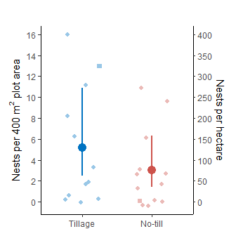

Analysis for Tschanz et al. 2022 J Appl Ecol
================
Philippe Tschanz, Stefan Vogel, Achim Walter, Thomas Keller, Matthias
Albrecht

-   <a href="#1-preliminaries" id="toc-1-preliminaries">1 Preliminaries</a>
    -   <a href="#11-load-libraries-settings-and-functions"
        id="toc-11-load-libraries-settings-and-functions">1.1 Load libraries,
        settings, and functions</a>
    -   <a href="#12-load-data-sets" id="toc-12-load-data-sets">1.2 Load data
        sets</a>
-   <a href="#2-materials-and-methods" id="toc-2-materials-and-methods">2
    Materials and methods</a>
    -   <a href="#21-shortest-distance-between-fields"
        id="toc-21-shortest-distance-between-fields">2.1 Shortest distance
        between fields</a>
-   <a href="#3-results" id="toc-3-results">3 Results</a>
    -   <a href="#31-nest-density-and-species-diversity-in-winter-cereal-fields"
        id="toc-31-nest-density-and-species-diversity-in-winter-cereal-fields">3.1
        Nest density and species diversity in winter cereal fields</a>
        -   <a href="#311-nest-density" id="toc-311-nest-density">3.1.1 Nest
            density</a>
        -   <a href="#312-species-diversity" id="toc-312-species-diversity">3.1.2
            Species diversity</a>
    -   <a href="#32-effects-of-tillage-system-on-nesting"
        id="toc-32-effects-of-tillage-system-on-nesting">3.2 Effects of tillage
        system on nesting</a>
        -   <a href="#321-nesting-incidence-nest-presence--absence"
            id="toc-321-nesting-incidence-nest-presence--absence">3.2.1 Nesting
            incidence (nest presence / absence)</a>
        -   <a href="#322-nesting-abundance" id="toc-322-nesting-abundance">3.2.2
            Nesting abundance</a>
    -   <a href="#33-effects-of-distance-from-field-edge-on-nest-density"
        id="toc-33-effects-of-distance-from-field-edge-on-nest-density">3.3
        Effects of distance from field edge on nest density</a>
    -   <a
        href="#34-vegetation-cover-soil-properties-and-landscape-context-driving-nesting"
        id="toc-34-vegetation-cover-soil-properties-and-landscape-context-driving-nesting">3.4
        Vegetation cover, soil properties and landscape context driving
        nesting</a>
        -   <a href="#341-effects-of-vegetation-cover-on-nesting-incidence"
            id="toc-341-effects-of-vegetation-cover-on-nesting-incidence">3.4.1
            Effects of vegetation cover on nesting incidence</a>
        -   <a href="#342-effects-of-soil-properties-on-nesting-incidence"
            id="toc-342-effects-of-soil-properties-on-nesting-incidence">3.4.2
            Effects of soil properties on nesting incidence</a>
        -   <a
            href="#343-effects-of-landscape-context-and-other-drivers-on-nest-abundance"
            id="toc-343-effects-of-landscape-context-and-other-drivers-on-nest-abundance">3.4.3
            Effects of landscape context (and other drivers) on nest abundance</a>
-   <a href="#4-figures" id="toc-4-figures">4 Figures</a>
    -   <a href="#41-figure-1" id="toc-41-figure-1">4.1 Figure 1</a>
    -   <a href="#42-figure-2" id="toc-42-figure-2">4.2 Figure 2</a>
    -   <a href="#43-figure-3" id="toc-43-figure-3">4.3 Figure 3</a>
    -   <a href="#44-figure-4" id="toc-44-figure-4">4.4 Figure 4</a>

# 1 Preliminaries

## 1.1 Load libraries, settings, and functions

``` r
library(here)
```

    ## here() starts at D:/PhD/Manuscripts/Field Survey/GitHub/Tschanz_et_al_2022_JAppEcol

``` r
library(tidyverse)
```

    ## ── Attaching packages
    ## ───────────────────────────────────────
    ## tidyverse 1.3.2 ──

    ## ✔ ggplot2 3.3.6     ✔ purrr   0.3.4
    ## ✔ tibble  3.1.8     ✔ dplyr   1.0.9
    ## ✔ tidyr   1.2.0     ✔ stringr 1.4.1
    ## ✔ readr   2.1.2     ✔ forcats 0.5.2
    ## ── Conflicts ────────────────────────────────────────── tidyverse_conflicts() ──
    ## ✖ dplyr::filter() masks stats::filter()
    ## ✖ dplyr::lag()    masks stats::lag()

``` r
library(sf)
```

    ## Linking to GEOS 3.9.1, GDAL 3.4.3, PROJ 7.2.1; sf_use_s2() is TRUE

``` r
library(MuMIn)
library(MASS)
```

    ## 
    ## Attaching package: 'MASS'
    ## 
    ## The following object is masked from 'package:dplyr':
    ## 
    ##     select

``` r
library(pscl)
```

    ## Classes and Methods for R developed in the
    ## Political Science Computational Laboratory
    ## Department of Political Science
    ## Stanford University
    ## Simon Jackman
    ## hurdle and zeroinfl functions by Achim Zeileis

``` r
library(ggpubr)
library(lme4)
```

    ## Loading required package: Matrix
    ## 
    ## Attaching package: 'Matrix'
    ## 
    ## The following objects are masked from 'package:tidyr':
    ## 
    ##     expand, pack, unpack

``` r
library(arm)
```

    ## 
    ## arm (Version 1.13-1, built: 2022-8-25)
    ## 
    ## Working directory is D:/PhD/Manuscripts/Field Survey/GitHub/Tschanz_et_al_2022_JAppEcol/scripts
    ## 
    ## 
    ## Attaching package: 'arm'
    ## 
    ## The following object is masked from 'package:MuMIn':
    ## 
    ##     coefplot

``` r
library(ggeffects)

select <- dplyr::select  # because MASS overrides dplyr function 'select'

## final figures, tables, and models are saved into lists
tables <- list()
figures <- list()
modlist <- list()

## defining global settings of parameters (for consistency)
parm <- list()
parm$col_2cat <- c("#0073C2FF", "#CD534CFF")
parm$shp_2cat <- c(16, 15)
parm$lab_sqa_cov_bare <- expression(Bare~ground~("%"))
parm$lab_soil_rel_dens <- expression(Relative~soil~bulk~density)
parm$lab_soil_ph <- expression(Soil~pH)
parm$lab_soil_sand <- expression(Sand~content~("%"))
parm$lab_lsc_dist_to_BPA <- "Distance to nearest BPA (m)"
parm$lab_lsc_BPA_500m <- "%BPA in 500 m radius"

## knitr settings
knitr::opts_chunk$set(
  echo = TRUE,
  dev = c("png", "pdf"))

## load custom functions
source(here("scripts", "functions.R"))
```

## 1.2 Load data sets

``` r
d.soil <- read_rds(here("data", "soil.rds"))
d.veg <- read_rds(here("data", "vegetation.rds"))
d.nest <- read_rds(here("data", "nests.rds"))
d.spec <- read_rds(here("data", "species.rds"))
d.field <- read_rds(here("data", "field_level_data.rds"))
sf.fields <- st_read(here("data", "geodata.gpkg"), layer = "fields")
```

    ## Reading layer `fields' from data source 
    ##   `D:\PhD\Manuscripts\Field Survey\GitHub\Tschanz_et_al_2022_JAppEcol\data\geodata.gpkg' 
    ##   using driver `GPKG'
    ## Simple feature collection with 25 features and 2 fields
    ## Geometry type: MULTIPOLYGON
    ## Dimension:     XY
    ## Bounding box:  xmin: 2486367 ymin: 1110893 xmax: 2523300 ymax: 1161005
    ## Projected CRS: CH1903+ / LV95

# 2 Materials and methods

Analysis for results reported in the *Materials and methods* section.

## 2.1 Shortest distance between fields

What is the shortest distance (in m) that the fields are apart?

``` r
index <- st_nearest_feature(sf.fields)
dist <- st_distance(sf.fields, sf.fields[index,], by_element = TRUE)
min(dist)
```

    ## 916.173 [m]

# 3 Results

Analysis for the results, figures, and tables reported in the *Results*
section following the same outline as in the manuscript.

## 3.1 Nest density and species diversity in winter cereal fields

### 3.1.1 Nest density

Number of fields with nest presence (1) and without nest presence (0)
across both sampling rounds:

``` r
table(d.field$pooled$nest_pa)
```

    ## 
    ##  0  1 
    ##  8 17

Range, standard deviation, and mean nest density, summed over both
sampling rounds, within fields per $400 m^2$ sampling area, i.e., the
number of nests counted within the eight $50\times 1m$ belt transects:

``` r
density_400m2 <- d.field$pooled$nest_n
print(paste0("Mean (nests per 400m2): ", mean(density_400m2)))
```

    ## [1] "Mean (nests per 400m2): 4.04"

``` r
print(paste0("Range (nests per 400m2): ", min(density_400m2), "-", max(density_400m2)))
```

    ## [1] "Range (nests per 400m2): 0-16"

``` r
print(paste0("SD (nests per 400m2): ", sd(density_400m2)))
```

    ## [1] "SD (nests per 400m2): 4.76515127426892"

Same but expressed per hectare:

``` r
density_ha <- d.field$pooled$nest_n / 400 * 100 * 100
print(paste0("Mean (nests per ha): ", mean(density_ha)))
```

    ## [1] "Mean (nests per ha): 101"

``` r
print(paste0("Range (nests per ha): ", min(density_ha), "-", max(density_ha)))
```

    ## [1] "Range (nests per ha): 0-400"

``` r
print(paste0("SD (nests per ha): ", sd(density_ha)))
```

    ## [1] "SD (nests per ha): 119.128781856723"

Proportion of installed traps (in %) that captured the nesting female:

``` r
dat <- table(d.nest$trap_outcome)
print(paste0("Capture rate (%): ", round(dat[c("Success")] / (dat[c("Fail")] + dat[c("Success")]) * 100, 2)))
```

    ## [1] "Capture rate (%): 29.17"

### 3.1.2 Species diversity

The data of the following tables are shown combined in Table 1.

Number of individuals per species captured within the $400m^2$ sampling
area (CT = conventionally tilled, NT = no-till) of the 25 fields used
for analysis:

``` r
d.nest %>%
  filter(!is.na(nest_species)) %>%
  group_by(nest_species, mngt_soil, .drop = FALSE) %>%
  summarize(n = n()) %>%
  pivot_wider(c(nest_species), names_from = c(mngt_soil), values_from = n)
```

    ## `summarise()` has grouped output by 'nest_species'. You can override using the
    ## `.groups` argument.

    ## # A tibble: 15 × 3
    ## # Groups:   nest_species [15]
    ##    nest_species                CT    NT
    ##    <fct>                    <int> <int>
    ##  1 Andrena carantonica          1     0
    ##  2 Andrena dorsata              1     0
    ##  3 Andrena flavipes             3     0
    ##  4 Andrena lagopus              0     0
    ##  5 Andrena minutula             1     0
    ##  6 Andrena tibialis             1     0
    ##  7 Andrena ventralis            0     0
    ##  8 Colletes cunicularius        1     1
    ##  9 Lasioglossum calceatum       2     1
    ## 10 Lasioglossum leucozonium     0     1
    ## 11 Lasioglossum lineare         1     0
    ## 12 Lasioglossum malachurum      5     0
    ## 13 Lasioglossum pauxillum       0     3
    ## 14 Lasioglossum subhirtum       4     2
    ## 15 Lasioglossum villosulum      0     0

Number of individuals per species captured in the conventionally tilled
field that was excluded from the analysis because of its much later
sowing date compared to all other fields and consequently almost no
vegetation cover, but still providing interesting insights:

``` r
d.spec %>%
  filter(field == "JaPo02") %>%
  group_by(nest_species, mngt_soil, .drop = FALSE) %>%
  summarize(n = n()) %>%
  pivot_wider(c(nest_species), names_from = c(mngt_soil), values_from = n)
```

    ## `summarise()` has grouped output by 'nest_species'. You can override using the
    ## `.groups` argument.

    ## # A tibble: 15 × 3
    ## # Groups:   nest_species [15]
    ##    nest_species                CT    NT
    ##    <fct>                    <int> <int>
    ##  1 Andrena carantonica          0     0
    ##  2 Andrena dorsata              0     0
    ##  3 Andrena flavipes             0     0
    ##  4 Andrena lagopus              0     0
    ##  5 Andrena minutula             0     0
    ##  6 Andrena tibialis             0     0
    ##  7 Andrena ventralis            0     0
    ##  8 Colletes cunicularius        0     0
    ##  9 Lasioglossum calceatum       0     0
    ## 10 Lasioglossum leucozonium     0     0
    ## 11 Lasioglossum lineare         0     0
    ## 12 Lasioglossum malachurum      4     0
    ## 13 Lasioglossum pauxillum      13     0
    ## 14 Lasioglossum subhirtum       0     0
    ## 15 Lasioglossum villosulum      0     0

Number of individuals per species captured from incidentally found nests
inside fields but outside the $400m^2$ sampling area:

``` r
d.spec %>%
  filter(transect == "Outside") %>%
  group_by(nest_species, mngt_soil, .drop = FALSE) %>%
  summarize(n = n()) %>%
  pivot_wider(c(nest_species), names_from = c(mngt_soil), values_from = n)
```

    ## `summarise()` has grouped output by 'nest_species'. You can override using the
    ## `.groups` argument.

    ## # A tibble: 15 × 3
    ## # Groups:   nest_species [15]
    ##    nest_species                CT    NT
    ##    <fct>                    <int> <int>
    ##  1 Andrena carantonica          0     0
    ##  2 Andrena dorsata              0     0
    ##  3 Andrena flavipes             0     0
    ##  4 Andrena lagopus              0     2
    ##  5 Andrena minutula             0     0
    ##  6 Andrena tibialis             0     0
    ##  7 Andrena ventralis            0     1
    ##  8 Colletes cunicularius        0     0
    ##  9 Lasioglossum calceatum       0     0
    ## 10 Lasioglossum leucozonium     0     0
    ## 11 Lasioglossum lineare         0     0
    ## 12 Lasioglossum malachurum      2     0
    ## 13 Lasioglossum pauxillum       0     0
    ## 14 Lasioglossum subhirtum       0     0
    ## 15 Lasioglossum villosulum      0     0

Number of individuals per species captured from incidentally found nests
inside fields but outside the $400m^2$ sampling area:

``` r
d.spec %>%
  filter(transect == "PlowFurrow") %>%
  group_by(nest_species, mngt_soil, .drop = FALSE) %>%
  summarize(n = n()) %>%
  pivot_wider(c(nest_species), names_from = c(mngt_soil), values_from = n)
```

    ## `summarise()` has grouped output by 'nest_species'. You can override using the
    ## `.groups` argument.

    ## # A tibble: 15 × 3
    ## # Groups:   nest_species [15]
    ##    nest_species                CT    NT
    ##    <fct>                    <int> <int>
    ##  1 Andrena carantonica          0     0
    ##  2 Andrena dorsata              0     0
    ##  3 Andrena flavipes             1     0
    ##  4 Andrena lagopus              0     0
    ##  5 Andrena minutula             0     0
    ##  6 Andrena tibialis             0     0
    ##  7 Andrena ventralis            0     0
    ##  8 Colletes cunicularius        0     0
    ##  9 Lasioglossum calceatum       2     0
    ## 10 Lasioglossum leucozonium     0     0
    ## 11 Lasioglossum lineare         0     0
    ## 12 Lasioglossum malachurum      0     0
    ## 13 Lasioglossum pauxillum       0     0
    ## 14 Lasioglossum subhirtum       2     0
    ## 15 Lasioglossum villosulum      1     0

## 3.2 Effects of tillage system on nesting

### 3.2.1 Nesting incidence (nest presence / absence)

The model without interaction between tillage system and sampling round
and without sampling round as explanatory variable performs best in
terms of AICc. Neither the interaction between tillage system and
sampling round nor the sampling round are significant. Thus, the final
model included only tillage system. Table shown in Supplementary
Information as Table S2.

``` r
mod1 <- glm(
  nest_pa ~ mngt_soil * run,
  data = d.field$per_run,
  family = binomial(link = "logit"))

mod2 <- glm(
  nest_pa ~ mngt_soil + run,
  data = d.field$per_run,
  family = binomial(link = "logit"))

drop1(mod1, test = "Chisq")
```

    ## Single term deletions
    ## 
    ## Model:
    ## nest_pa ~ mngt_soil * run
    ##               Df Deviance    AIC      LRT Pr(>Chi)
    ## <none>             68.539 76.539                  
    ## mngt_soil:run  1   68.616 74.616 0.076731   0.7818

``` r
drop1(mod2, test = "Chisq")
```

    ## Single term deletions
    ## 
    ## Model:
    ## nest_pa ~ mngt_soil + run
    ##           Df Deviance    AIC     LRT Pr(>Chi)
    ## <none>         68.616 74.616                 
    ## mngt_soil  1   68.914 72.914 0.29798   0.5852
    ## run        1   68.697 72.697 0.08102   0.7759

Tillage has no significant effect on nesting incidence in the final
model:

``` r
modlist$tilsys_inc$data <- d.field$pooled
modlist$tilsys_inc$model <- glm(
  nest_pa ~ mngt_soil,
  data = d.field$pooled,
  family = binomial(link = "logit"))
drop1(modlist$tilsys_inc$model, test = "Chisq")
```

    ## Single term deletions
    ## 
    ## Model:
    ## nest_pa ~ mngt_soil
    ##           Df Deviance    AIC     LRT Pr(>Chi)
    ## <none>         30.819 34.819                 
    ## mngt_soil  1   31.343 33.343 0.52419   0.4691

### 3.2.2 Nesting abundance

To test the effects of tillage system on nest abundance, we used a
negative binomial model to account for overdispersion. Based on AIC, no
zero-inflation modelling approach is necessary and the negative binomial
model performed best.

``` r
modlist$tilsys_abu$data <- d.field$pooled
dat <- modlist$tilsys_abu$data

# poisson
mod.p <- glm(
  nest_n ~ mngt_soil, data = dat, family = poisson(link = "log"))
# negative binomial
mod.nb <- glm.nb(
  nest_n ~ mngt_soil, data = dat)
# zero-inflated poisson
mod.zip <- zeroinfl(
  nest_n ~ mngt_soil | mngt_soil, data = dat, dist = "poisson", link = "logit") 
# zero-inflated negative binomial
mod.zinb <- zeroinfl(
  nest_n ~ mngt_soil | mngt_soil, data = dat, dist = "negbin", link = "logit") 
# hurdle poisson
mod.hp <- hurdle(
  nest_n ~ mngt_soil | mngt_soil, data = dat, dist = "poisson", link = "logit") 
# hurdle negative binomial
mod.hnb <- hurdle(
  nest_n ~ mngt_soil | mngt_soil, data = dat, dist = "negbin", link = "logit") 

# model fit comparison
AIC(mod.p, mod.nb, mod.zip, mod.zinb, mod.hp, mod.hnb) %>% arrange(AIC)
```

    ##          df      AIC
    ## mod.nb    3 128.8559
    ## mod.zinb  5 131.4486
    ## mod.hnb   5 131.4486
    ## mod.zip   4 150.4909
    ## mod.hp    4 150.4909
    ## mod.p     2 189.3573

Neither the interaction between sampling round and tillage system nor
the sampling round had a significant effect on tillage system, thus only
tillage system was included. Table shown in Supplementary Information as
Table S2.

``` r
mod1 <- glm.nb(nest_n ~ mngt_soil * run, data = d.field$per_run)
mod2 <- glm.nb(nest_n ~ mngt_soil + run, data = d.field$per_run)

drop1(mod1, test = "Chisq")
```

    ## Single term deletions
    ## 
    ## Model:
    ## nest_n ~ mngt_soil * run
    ##               Df Deviance    AIC       LRT Pr(>Chi)
    ## <none>             45.318 186.81                   
    ## mngt_soil:run  1   45.319 184.81 0.0013343   0.9709

``` r
drop1(mod2, test = "Chisq")
```

    ## Single term deletions
    ## 
    ## Model:
    ## nest_n ~ mngt_soil + run
    ##           Df Deviance    AIC     LRT Pr(>Chi)
    ## <none>         45.317 184.81                 
    ## mngt_soil  1   46.451 183.95 1.13322   0.2871
    ## run        1   45.766 183.26 0.44869   0.5030

Tillage has no significant effect on nest abundance in the final model:

``` r
modlist$tilsys_abu$data <- d.field$pooled
modlist$tilsys_abu$model <- glm.nb(
  nest_n ~ mngt_soil, data = modlist$tilsys_abu$data)

# p-value for tillage effect
drop1(modlist$tilsys_abu$model, test = "Chisq")
```

    ## Single term deletions
    ## 
    ## Model:
    ## nest_n ~ mngt_soil
    ##           Df Deviance    AIC    LRT Pr(>Chi)
    ## <none>         27.716 126.86                
    ## mngt_soil  1   28.745 125.89 1.0288   0.3104

``` r
# 95% confidence interval using profile likelihood
confint(modlist$tilsys_abu$model)
```

    ## Waiting for profiling to be done...

    ##                  2.5 %    97.5 %
    ## (Intercept)  0.9616437 2.4673565
    ## mngt_soilNT -1.6150223 0.5150633

Compute mean and 95% confidence interval for the number of nests for
no-till and conventionally tilled fields, backtransformed to the scale
of the response:

``` r
# predict mean and 95% on scale of response
eff <- ggpredict(modlist$tilsys_abu$model)

newdat <- data.frame(
  mngt_soil = factor(c("CT", "NT"),
                     levels = c("CT", "NT"),
                     labels = c("Tillage", "No-till")))
newdat$fit <- eff$mngt_soil$predicted
newdat$lwr <- eff$mngt_soil$conf.low
newdat$upr <- eff$mngt_soil$conf.high
newdat
```

    ##   mngt_soil      fit      lwr       upr
    ## 1   Tillage 5.166667 2.458745 10.856939
    ## 2   No-till 3.000000 1.428727  6.299313

Same but converted to number of nests per hectare:

``` r
newdat$fit / 400 * 100 * 100
```

    ## [1] 129.1667  75.0000

Create plot with mean number of nests per tillage system and their 95%
CI:

``` r
dat <- d.field$pooled %>%
  mutate(mngt_soil = factor(
    mngt_soil, levels = c("CT", "NT"), labels = c("Tillage", "No-till")))

set.seed(36)
pos_dodge <- 0.75
colors <- parm$col_2cat
shapes <- parm$shp_2cat

figures$fig_1 <- ggplot(
  mapping = aes(x = mngt_soil, fill = mngt_soil,
             color = mngt_soil)) +
  # add points jittered
  geom_jitter(
    data = dat,
    mapping = aes(y = nest_n, shape = culture), 
    width = 0.25,
    size = 1.9, alpha = 0.4) +
  # add mean
  geom_point(
    data = newdat,
    mapping = aes(y = fit),
    size = 4) +
  # add 95% CI
  geom_errorbar(
    data = newdat,
    mapping = aes(ymax = upr, ymin = lwr),
    position = position_dodge(pos_dodge),
    width = 0, size = 1) +
  # style settings
  scale_fill_manual(values = colors, guide = "none") +
  scale_color_manual(values = colors, guide = "none") +
  scale_shape_manual(values= shapes, guide = "none") +
  scale_y_continuous(
    breaks = seq(0, 100, 2),
    sec.axis = sec_axis(
      trans = ~ .x * 25,
      breaks = seq(0, 400, 50),
      name = expression("Nests" ~ "per" ~ "hectare"))) +
  pt_theme() +
  labs(
    y = expression("Nests" ~ "per" ~ 400 ~ m^2 ~ "plot area"),
    x = NULL)
```

## 3.3 Effects of distance from field edge on nest density

Create new data set for analysis containing the number of nests per
field and transect. For the distance, we use the middle of the transect
(e.g., the 0-1 m transect uses 0.5 m) for computation:

``` r
# prepare data
modlist$dist$data <- d.nest %>%
  count(field, transect, .drop = FALSE, name = "nest_n") %>%
  mutate(
    dist_m = as.numeric(word(transect, sep = "\\-")) + 0.5,
    dist_m.log10 = log10(dist_m)) %>%
  left_join(., select(d.field$pooled, field, mngt_soil), by = "field")
```

For the discussion: what is the proportion (in %) of nests found on
tramlines (`tramline` = yes) for each transects?

``` r
tab <- table(d.nest$tramline, d.nest$transect)
round(prop.table(tab, margin = 2) * 100, 0)
```

    ##      
    ##       0-1m 1-2m 2-3m 5-6m 10-11m 15-16m 20-21m 30-31m
    ##   no   100  100  100  100    100    100     89     58
    ##   yes    0    0    0    0      0      0     11     42

Including tillage system does not improve model fit. Number of nests
better described with an exponential decline relationship, which is used
as final model. Results reported in Table S3 in the Supplementary
Information.

``` r
mod.dist <- glmer.nb(nest_n ~ scale(dist_m) + (1|field), data =  modlist$dist$data)
mod.ldist <- glmer.nb(nest_n ~ scale(dist_m.log10) + (1|field), data =  modlist$dist$data)
mod.dist_till <- glmer.nb(nest_n ~ scale(dist_m)*mngt_soil + (1|field), data =  modlist$dist$data)
mod.ldist_till <- glmer.nb(nest_n ~ scale(dist_m.log10)*mngt_soil + (1|field), data =  modlist$dist$data)

AICc(mod.dist, mod.ldist, mod.dist_till, mod.ldist_till) %>% arrange(AICc)
```

    ##                df     AICc
    ## mod.ldist       4 343.3569
    ## mod.ldist_till  6 345.3122
    ## mod.dist        4 352.6828
    ## mod.dist_till   6 354.5373

``` r
modlist$dist$model <- mod.ldist # final model
```

Get estimates, confidence intervals, and p-values for Table 2.

``` r
summary(modlist$dist$model)
```

    ## Generalized linear mixed model fit by maximum likelihood (Laplace
    ##   Approximation) [glmerMod]
    ##  Family: Negative Binomial(1.133)  ( log )
    ## Formula: nest_n ~ scale(dist_m.log10) + (1 | field)
    ##    Data: modlist$dist$data
    ## 
    ##      AIC      BIC   logLik deviance df.resid 
    ##    343.2    356.3   -167.6    335.2      196 
    ## 
    ## Scaled residuals: 
    ##     Min      1Q  Median      3Q     Max 
    ## -0.8574 -0.4354 -0.3124 -0.1977  6.0633 
    ## 
    ## Random effects:
    ##  Groups Name        Variance Std.Dev.
    ##  field  (Intercept) 1.591    1.261   
    ## Number of obs: 200, groups:  field, 25
    ## 
    ## Fixed effects:
    ##                     Estimate Std. Error z value Pr(>|z|)    
    ## (Intercept)          -1.5193     0.3464  -4.386 1.15e-05 ***
    ## scale(dist_m.log10)  -0.5177     0.1312  -3.946 7.96e-05 ***
    ## ---
    ## Signif. codes:  0 '***' 0.001 '**' 0.01 '*' 0.05 '.' 0.1 ' ' 1
    ## 
    ## Correlation of Fixed Effects:
    ##             (Intr)
    ## scl(ds_.10) 0.179

``` r
confint(modlist$dist$model)
```

    ## Computing profile confidence intervals ...

    ##                          2.5 %     97.5 %
    ## .sig01               0.7671471  2.0942685
    ## (Intercept)         -2.3480647 -0.9134453
    ## scale(dist_m.log10) -0.7808297 -0.2647820

``` r
drop1(modlist$dist$model, test = "Chisq") # p-value from LRT test
```

    ## Single term deletions
    ## 
    ## Model:
    ## nest_n ~ scale(dist_m.log10) + (1 | field)
    ##                     npar    AIC   LRT   Pr(Chi)    
    ## <none>                   343.15                    
    ## scale(dist_m.log10)    1 357.60 16.45 4.996e-05 ***
    ## ---
    ## Signif. codes:  0 '***' 0.001 '**' 0.01 '*' 0.05 '.' 0.1 ' ' 1

Refit model without standardizing predictor to avoid backtransformation
for plotting. Compute Bayesian 95% credible intervals based on 2000
random draws from the joint posterior distribution. Note that for the
modelling, we used the middle of the transect as distance (e.g. 2-3 m
transect uses 2.5 m as distance from field edge) but plot the error bars
0, 1, 2, … m for nicer visualization.

``` r
dat <- modlist$dist$data
mod <- glmer.nb(nest_n ~ dist_m.log10 + (1|field), data =  dat)

# get bayesian 95% credible interval
nsim <- 2000
newdat <- data.frame(dist_m = seq(0, 30, length.out = 200))
newdat$dist_m.log10 <- log10(newdat$dist_m)
bsim <- sim(mod, n.sim = nsim)
Xmat <- model.matrix(~dist_m.log10, data = newdat)
newdat$fit <- exp(Xmat %*% fixef(mod))
fitmat <- matrix(ncol = nsim, nrow = nrow(newdat))
for(i in 1:nsim) fitmat[,i] <- exp(Xmat %*% bsim@fixef[i,])
newdat$lwr <- apply(fitmat, 1, quantile, prob = 0.025)
newdat$upr <- apply(fitmat, 1, quantile, prob = 0.975)

# mean number of nests +- se per transect
dat_stats <- dat %>%
  group_by(dist_m) %>%
  summarize(
    .groups = "drop",
    n = n(),
    mean = mean(nest_n),
    se = sd(nest_n) / sqrt(n),
    upr = mean + se,
    lwr = mean - se)

# figure 2
figures$fig_2 <- ggplot() +
    # error bars based on raw data
    geom_point(
      data = dat_stats,
      aes(y = mean, x = dist_m-0.5),
      size = 2.5) +
    geom_errorbar(
      data = dat_stats,
      aes(ymax = upr, ymin = lwr, x = dist_m-0.5),
      width = 0.2, size = 0.5) + 
    # model fit
    geom_line(
      data = newdat,
      aes(y = fit, x = dist_m),
      size = 1) +
    geom_ribbon(
      data = newdat,
      aes(ymin = lwr, ymax = upr, x = dist_m), alpha = .3) +
    # visualization settings
    scale_x_continuous(breaks = c(0, 1:2, 5, 10, 15, 20, 30)) +
    coord_cartesian(ylim = c(0, 1.5)) +
    pt_theme() +
    theme(legend.position = c(0.85, 0.9)) +
    labs(
      y = expression("Nests" ~ "per" ~ "transect" ~ "(mean" ~ "\u00B1" ~ "SE)"),
      x = "Distance from field edge (m)")
```

## 3.4 Vegetation cover, soil properties and landscape context driving nesting

### 3.4.1 Effects of vegetation cover on nesting incidence

Effects of bare soil cover on nest presence/absence at the 10x10 cm and
the 1x1m scale. Only bare soil cover was used due to high collinearity
with other cover variables.

``` r
# 10 cm2 plots
modlist$veg_10cm$data <- d.veg %>%
  filter(scale == "10cm") %>%
  select(nest_pa, field, sqa_cov_bare) %>%
  mutate(sqa_cov_bare.z = as.numeric(scale(sqa_cov_bare)))

# 1 m2 plots
modlist$veg_1m$data <- d.veg %>%
  filter(scale == "1m") %>%
  select(nest_pa, field, sqa_cov_bare) %>%
  mutate(sqa_cov_bare.z = as.numeric(scale(sqa_cov_bare)))
```

``` r
modlist$veg_10cm$model <- glmer(
  nest_pa ~ sqa_cov_bare.z + (1|field),
  data = modlist$veg_10cm$data,
  family = binomial(link = "logit"),
  na.action = na.fail,
  glmerControl(optimizer = "bobyqa", optCtrl = list(maxfun = 100000)))

modlist$veg_1m$model <- glmer(
  nest_pa ~ sqa_cov_bare.z + (1|field),
  data = modlist$veg_1m$data,
  family = binomial(link = "logit"),
  na.action = na.fail,
  glmerControl(optimizer = "bobyqa", optCtrl = list(maxfun = 100000)))
```

Model output as reported in Table 2 for the 10 cm scale:

``` r
summary(modlist$veg_10cm$model)
```

    ## Generalized linear mixed model fit by maximum likelihood (Laplace
    ##   Approximation) [glmerMod]
    ##  Family: binomial  ( logit )
    ## Formula: nest_pa ~ sqa_cov_bare.z + (1 | field)
    ##    Data: modlist$veg_10cm$data
    ## Control: glmerControl(optimizer = "bobyqa", optCtrl = list(maxfun = 1e+05))
    ## 
    ##      AIC      BIC   logLik deviance df.resid 
    ##    391.6    404.8   -192.8    385.6      597 
    ## 
    ## Scaled residuals: 
    ##     Min      1Q  Median      3Q     Max 
    ## -1.8152 -0.3565 -0.1335 -0.0551  5.3263 
    ## 
    ## Random effects:
    ##  Groups Name        Variance Std.Dev.
    ##  field  (Intercept) 1.376    1.173   
    ## Number of obs: 600, groups:  field, 25
    ## 
    ## Fixed effects:
    ##                Estimate Std. Error z value Pr(>|z|)    
    ## (Intercept)     -3.0187     0.3807  -7.930 2.20e-15 ***
    ## sqa_cov_bare.z   1.7791     0.2199   8.089 6.03e-16 ***
    ## ---
    ## Signif. codes:  0 '***' 0.001 '**' 0.01 '*' 0.05 '.' 0.1 ' ' 1
    ## 
    ## Correlation of Fixed Effects:
    ##             (Intr)
    ## sqa_cv_br.z -0.536

``` r
drop1(modlist$veg_10cm$model, test = "Chisq")
```

    ## Single term deletions
    ## 
    ## Model:
    ## nest_pa ~ sqa_cov_bare.z + (1 | field)
    ##                npar    AIC    LRT   Pr(Chi)    
    ## <none>              391.64                     
    ## sqa_cov_bare.z    1 498.20 108.56 < 2.2e-16 ***
    ## ---
    ## Signif. codes:  0 '***' 0.001 '**' 0.01 '*' 0.05 '.' 0.1 ' ' 1

``` r
confint(modlist$veg_10cm$model)
```

    ## Computing profile confidence intervals ...

    ##                     2.5 %    97.5 %
    ## .sig01          0.6790177  1.985441
    ## (Intercept)    -3.9039214 -2.357150
    ## sqa_cov_bare.z  1.3742853  2.240072

Model output as reported in Table 2 for the 1m scale:

``` r
summary(modlist$veg_1m$model)
```

    ## Generalized linear mixed model fit by maximum likelihood (Laplace
    ##   Approximation) [glmerMod]
    ##  Family: binomial  ( logit )
    ## Formula: nest_pa ~ sqa_cov_bare.z + (1 | field)
    ##    Data: modlist$veg_1m$data
    ## Control: glmerControl(optimizer = "bobyqa", optCtrl = list(maxfun = 1e+05))
    ## 
    ##      AIC      BIC   logLik deviance df.resid 
    ##    450.2    463.4   -222.1    444.2      597 
    ## 
    ## Scaled residuals: 
    ##     Min      1Q  Median      3Q     Max 
    ## -1.2722 -0.4326 -0.2194 -0.1034  4.6801 
    ## 
    ## Random effects:
    ##  Groups Name        Variance Std.Dev.
    ##  field  (Intercept) 1.092    1.045   
    ## Number of obs: 600, groups:  field, 25
    ## 
    ## Fixed effects:
    ##                Estimate Std. Error z value Pr(>|z|)    
    ## (Intercept)     -2.4819     0.3198  -7.760 8.47e-15 ***
    ## sqa_cov_bare.z   1.2289     0.1993   6.167 6.97e-10 ***
    ## ---
    ## Signif. codes:  0 '***' 0.001 '**' 0.01 '*' 0.05 '.' 0.1 ' ' 1
    ## 
    ## Correlation of Fixed Effects:
    ##             (Intr)
    ## sqa_cv_br.z -0.406

``` r
drop1(modlist$veg_1m$model, test = "Chisq")
```

    ## Single term deletions
    ## 
    ## Model:
    ## nest_pa ~ sqa_cov_bare.z + (1 | field)
    ##                npar    AIC    LRT   Pr(Chi)    
    ## <none>              450.24                     
    ## sqa_cov_bare.z    1 498.20 49.962 1.567e-12 ***
    ## ---
    ## Signif. codes:  0 '***' 0.001 '**' 0.01 '*' 0.05 '.' 0.1 ' ' 1

``` r
confint(modlist$veg_1m$model)
```

    ## Computing profile confidence intervals ...

    ##                     2.5 %    97.5 %
    ## .sig01          0.5822576  1.801408
    ## (Intercept)    -3.2483338 -1.932457
    ## sqa_cov_bare.z  0.8606898  1.648355

Create Fig. 3 combining results from both scales and compute 95%
Bayesian credible intervals:

``` r
# get 95% credible intervals (1m scale)
modlist$veg_1m$newdata <- pt_get_effects.glmm_pa(
  data = modlist$veg_1m$data,
  model = modlist$veg_1m$model,
  var_x = "sqa_cov_bare.z")

# get 95% credible intervals (10cm scale)
modlist$veg_10cm$newdata <- pt_get_effects.glmm_pa(
  data = modlist$veg_10cm$data,
  model = modlist$veg_10cm$model,
  var_x = "sqa_cov_bare.z")

figures$fig_3a <- pt_plot_effects.pa.2scales(
  dat_1m = modlist$veg_1m$data,
  dat_10cm = modlist$veg_10cm$data,
  newdat_1m = modlist$veg_1m$newdata,
  newdat_10cm = modlist$veg_10cm$newdata,
  var_x = "sqa_cov_bare.z",
  lab_x = parm$lab_sqa_cov_bare,
  pval_10cm = "paste(italic(beta), \" = 1.78 [1.37, 2.24], \", italic(p), \" < 0.001\")",
  pval_1m = "paste(italic(beta), \" = 1.23 [0.86, 1.65], \", italic(p), \" < 0.001\")")
```

### 3.4.2 Effects of soil properties on nesting incidence

Fit full model with selected soil variables (based on biological
reasoning and to avoid collinearity issues):

``` r
modlist$soil$data <- d.soil %>%
  mutate(
    soil_rel_dens.z = scale(soil_rel_dens),
    soil_ph.z = scale(soil_ph),
    soil_sand.z = scale(soil_sand))

modlist$soil$mod_full <- glmer(
  formula = nest_pa ~ soil_rel_dens.z + soil_ph.z + soil_sand.z + (1|field),
  data = modlist$soil$data,
  family = binomial(link = "logit"), na.action = na.fail,
  glmerControl(optimizer = "bobyqa", optCtrl = list(maxfun = 100000)))
```

Identify and show best models (AICc \< 2):

``` r
modlist$soil$mod_set <- dredge(modlist$soil$mod_full)
```

    ## Fixed term is "(Intercept)"

``` r
modlist$soil$mod_top <- get.models(modlist$soil$mod_set, subset = delta < 2)
model.sel(modlist$soil$mod_top)
```

    ## Model selection table 
    ##     (Int) sol_rel_dns.z sol_snd.z sol_ph.z df   logLik  AICc delta weight
    ## 7 -0.9165        0.5200    0.3435           4 -104.581 217.4  0.00  0.493
    ## 3 -0.9830        0.5788                     3 -106.139 218.4  1.02  0.296
    ## 8 -0.8958        0.4858    0.3343     0.12  5 -104.371 219.1  1.70  0.211
    ## Models ranked by AICc(x) 
    ## Random terms (all models): 
    ##   1 | field

Model averaged summary of top models (AICc \< 2):

``` r
modlist$soil$mod_avg <- model.avg(modlist$soil$mod_top)
summary(modlist$soil$mod_avg)
```

    ## 
    ## Call:
    ## model.avg(object = modlist$soil$mod_top)
    ## 
    ## Component model call: 
    ## glmer(formula = nest_pa ~ <3 unique rhs>, data = modlist$soil$data, 
    ##      family = binomial(link = "logit"), control = glmerControl(optimizer = 
    ##      "bobyqa", optCtrl = list(maxfun = 1e+05)), na.action = na.fail)
    ## 
    ## Component models: 
    ##     df  logLik   AICc delta weight
    ## 23   4 -104.58 217.39  0.00   0.49
    ## 2    3 -106.14 218.42  1.02   0.30
    ## 123  5 -104.37 219.09  1.70   0.21
    ## 
    ## Term codes: 
    ##       soil_ph.z soil_rel_dens.z     soil_sand.z 
    ##               1               2               3 
    ## 
    ## Model-averaged coefficients:  
    ## (full average) 
    ##                 Estimate Std. Error Adjusted SE z value Pr(>|z|)    
    ## (Intercept)     -0.93179    0.24025     0.24189   3.852 0.000117 ***
    ## soil_rel_dens.z  0.53018    0.21320     0.21465   2.470 0.013510 *  
    ## soil_sand.z      0.24005    0.21979     0.22056   1.088 0.276431    
    ## soil_ph.z        0.02533    0.09671     0.09722   0.261 0.794422    
    ##  
    ## (conditional average) 
    ##                 Estimate Std. Error Adjusted SE z value Pr(>|z|)    
    ## (Intercept)      -0.9318     0.2403      0.2419   3.852 0.000117 ***
    ## soil_rel_dens.z   0.5302     0.2132      0.2146   2.470 0.013510 *  
    ## soil_sand.z       0.3408     0.1851      0.1864   1.829 0.067453 .  
    ## soil_ph.z         0.1200     0.1815      0.1828   0.657 0.511474    
    ## ---
    ## Signif. codes:  0 '***' 0.001 '**' 0.01 '*' 0.05 '.' 0.1 ' ' 1

95% confidence intervals (conditional):

``` r
confint(modlist$soil$mod_avg, full = FALSE)
```

    ##                       2.5 %     97.5 %
    ## (Intercept)     -1.40588611 -0.4576901
    ## soil_rel_dens.z  0.10948319  0.9508764
    ## soil_sand.z     -0.02447337  0.7060532
    ## soil_ph.z       -0.23825514  0.4782778

Variable importance:

``` r
sw(modlist$soil$mod_avg)
```

    ##                      soil_rel_dens.z soil_sand.z soil_ph.z
    ## Sum of weights:      1.00            0.70        0.21     
    ## N containing models:    3               2           1

Show all in nicely formatted table

``` r
pt_get_tab_mod_avg(modlist$soil$mod_avg, type = "cond.avg")
```

    ##         Parameter Estimate         95% CI p-value Relative importance
    ## 1     (Intercept)    -0.93 [-1.41, -0.46] < 0.001                  NA
    ## 2 soil_rel_dens.z     0.53   [0.11, 0.95]   0.014                1.00
    ## 3     soil_sand.z     0.34  [-0.02, 0.71]   0.067                0.70
    ## 4       soil_ph.z     0.12  [-0.24, 0.48]   0.511                0.21

Figure 3b-d:

``` r
dat <- modlist$soil$data
mod <- modlist$soil$mod_top

# 3b) relative soil bulk density
var <- "soil_rel_dens.z"
newdat <- pt_get_effects.MuMIn_pa(dat, mod, var, "cond.avg")
figures$fig_3b <- pt_plot_effects.pa(
  data = dat,
  newdata = newdat,
  var_x = var,
  lab_x = parm$lab_soil_rel_dens,
  lab_stats = "paste(italic(beta), \" = 0.53 [0.11, 0.95], \", italic(p), \" = 0.014\")",
  sign = TRUE,
  breaks = seq(0, 1, .05))

# 3c) sand content
var <- "soil_sand.z"
newdat <- pt_get_effects.MuMIn_pa(dat, mod, var, "cond.avg")
figures$fig_3c <- pt_plot_effects.pa(
  data = dat,
  newdata = newdat,
  var_x = var,
  lab_x = parm$lab_soil_sand,
  lab_stats = "paste(italic(beta), \" = 0.34 [-0.02, 0.71], \", italic(p), \" = 0.067\")",
  sign = FALSE)

# 3d) soil ph
var <- "soil_ph.z"
newdat <- pt_get_effects.MuMIn_pa(dat, mod, var, "cond.avg")
figures$fig_3d <- pt_plot_effects.pa(
  data = dat,
  newdata = newdat,
  var_x = var,
  lab_x = parm$lab_soil_ph,
  lab_stats = "paste(italic(beta), \" = 0.12 [-0.24, 0.48], \", italic(p), \" = 0.511\")",
  sign = FALSE)
```

### 3.4.3 Effects of landscape context (and other drivers) on nest abundance

``` r
modlist$abu$data <- d.field$pooled %>%
  mutate(
    soil_rel_dens.z = as.numeric(scale(soil_rel_dens)),
    soil_sand.z = as.numeric(scale(soil_sand)),
    sqa_cov_bare.z = as.numeric(scale(sqa_cov_bare)),
    lsc_Grassland_500m.z = as.numeric(scale(lsc_Grassland_500m)),
    lsc_Crop_500m.z = as.numeric(scale(lsc_Crop_500m)),
    lsc_BPA_500m.z = as.numeric(scale(lsc_BPA_500m)),
    lsc_dist_to_BPA.z = as.numeric(scale(lsc_dist_to_BPA)))
```

Fit full model:

``` r
sel_vars <- c(
  "soil_rel_dens.z", "soil_sand.z", "sqa_cov_bare.z", "lsc_Grassland_500m.z",
  "lsc_Crop_500m.z", "lsc_BPA_500m.z", "lsc_dist_to_BPA.z")

modlist$abu$mod_full <- glm.nb(
  formula = as.formula(paste0("nest_n ~ ", paste0(sel_vars, collapse = " + "))),
  data = modlist$abu$data, na.action = na.fail)
```

Identify and show set of best models (AICc \< 1.5):

``` r
modlist$abu$mod_set <- dredge(modlist$abu$mod_full)
```

    ## Fixed term is "(Intercept)"

``` r
modlist$abu$mod_top <- get.models(modlist$abu$mod_set, subset = delta < 1.5)
model.sel(modlist$abu$mod_top)
```

    ## Model selection table 
    ##      (Int) lsc_dst_to_BPA.z sol_rel_dns.z sqa_cov_bar.z sol_snd.z lsc_BPA_500.z
    ## 85  0.9680          -0.5358        0.4709        0.6772                        
    ## 65  1.1120                                       0.7825                        
    ## 69  1.0440          -0.4551                      0.7722                        
    ## 113 0.9887                         0.4899        0.5879    0.4178              
    ## 81  1.0650                         0.4037        0.7137                        
    ## 66  1.0710                                       0.8500                   0.375
    ## 82  1.0160                         0.4017        0.7633                   0.385
    ## 97  1.0610                                       0.7019    0.3266              
    ##           family init.theta df  logLik  AICc delta weight
    ## 85  NB(1.6933,l)       1.69  5 -54.217 121.6  0.00  0.176
    ## 65  NB(1.1698,l)       1.17  3 -57.382 121.9  0.32  0.150
    ## 69  NB(1.3844,l)       1.38  4 -56.039 122.1  0.49  0.138
    ## 113 NB(1.7005,l)        1.7  5 -54.565 122.3  0.70  0.124
    ## 81  NB(1.3662,l)       1.37  4 -56.171 122.3  0.75  0.121
    ## 66  NB(1.3153,l)       1.32  4 -56.267 122.5  0.94  0.110
    ## 82  NB(1.5751,l)       1.58  5 -54.840 122.8  1.25  0.094
    ## 97  NB(1.3653,l)       1.37  4 -56.490 123.0  1.39  0.088
    ## Abbreviations:
    ##  family: NB(1.1698,l) = 'Negative Binomial(1.1698,log)', 
    ##          NB(1.3153,l) = 'Negative Binomial(1.3153,log)', 
    ##          NB(1.3653,l) = 'Negative Binomial(1.3653,log)', 
    ##          NB(1.3662,l) = 'Negative Binomial(1.3662,log)', 
    ##          NB(1.3844,l) = 'Negative Binomial(1.3844,log)', 
    ##          NB(1.5751,l) = 'Negative Binomial(1.5751,log)', 
    ##          NB(1.6933,l) = 'Negative Binomial(1.6933,log)', 
    ##          NB(1.7005,l) = 'Negative Binomial(1.7005,log)'
    ## Models ranked by AICc(x)

Model averaged summary:

``` r
modlist$abu$mod_avg <- model.avg(modlist$abu$mod_top)
summary(modlist$abu$mod_avg)
```

    ## 
    ## Call:
    ## model.avg(object = modlist$abu$mod_top)
    ## 
    ## Component model call: 
    ## glm.nb(formula = nest_n ~ <8 unique rhs>, data = modlist$abu$data, 
    ##      na.action = na.fail, init.theta = <8 unique values>, link = log)
    ## 
    ## Component models: 
    ##     df logLik   AICc delta weight
    ## 235  5 -54.22 121.59  0.00   0.18
    ## 5    3 -57.38 121.91  0.32   0.15
    ## 25   4 -56.04 122.08  0.49   0.14
    ## 345  5 -54.56 122.29  0.70   0.12
    ## 35   4 -56.17 122.34  0.75   0.12
    ## 15   4 -56.27 122.53  0.94   0.11
    ## 135  5 -54.84 122.84  1.25   0.09
    ## 45   4 -56.49 122.98  1.39   0.09
    ## 
    ## Term codes: 
    ##    lsc_BPA_500m.z lsc_dist_to_BPA.z   soil_rel_dens.z       soil_sand.z 
    ##                 1                 2                 3                 4 
    ##    sqa_cov_bare.z 
    ##                 5 
    ## 
    ## Model-averaged coefficients:  
    ## (full average) 
    ##                   Estimate Std. Error Adjusted SE z value Pr(>|z|)    
    ## (Intercept)        1.03838    0.22438     0.23699   4.381 1.18e-05 ***
    ## lsc_dist_to_BPA.z -0.15686    0.27389     0.27850   0.563  0.57327    
    ## soil_rel_dens.z    0.23010    0.27942     0.28546   0.806  0.42021    
    ## sqa_cov_bare.z     0.72864    0.24218     0.25513   2.856  0.00429 ** 
    ## soil_sand.z        0.08051    0.18455     0.18769   0.429  0.66798    
    ## lsc_BPA_500m.z     0.07740    0.18060     0.18370   0.421  0.67352    
    ##  
    ## (conditional average) 
    ##                   Estimate Std. Error Adjusted SE z value Pr(>|z|)    
    ## (Intercept)         1.0384     0.2244      0.2370   4.381 1.18e-05 ***
    ## lsc_dist_to_BPA.z  -0.5004     0.2597      0.2748   1.821  0.06868 .  
    ## soil_rel_dens.z     0.4471     0.2339      0.2477   1.805  0.07104 .  
    ## sqa_cov_bare.z      0.7286     0.2422      0.2551   2.856  0.00429 ** 
    ## soil_sand.z         0.3800     0.2167      0.2291   1.659  0.09715 .  
    ## lsc_BPA_500m.z      0.3796     0.2127      0.2254   1.684  0.09212 .  
    ## ---
    ## Signif. codes:  0 '***' 0.001 '**' 0.01 '*' 0.05 '.' 0.1 ' ' 1

95% confidence interval (conditiona):

``` r
confint(modlist$abu$mod_avg, full = FALSE)
```

    ##                         2.5 %     97.5 %
    ## (Intercept)        0.57387466 1.50287635
    ## lsc_dist_to_BPA.z -1.03903445 0.03831826
    ## soil_rel_dens.z   -0.03832877 0.93244275
    ## sqa_cov_bare.z     0.22859465 1.22867844
    ## soil_sand.z       -0.06898540 0.82898299
    ## lsc_BPA_500m.z    -0.06211982 0.82132747

Variable importance:

``` r
sw(modlist$abu$mod_avg)
```

    ##                      sqa_cov_bare.z soil_rel_dens.z lsc_dist_to_BPA.z
    ## Sum of weights:      1.00           0.51            0.31             
    ## N containing models:    8              4               2             
    ##                      soil_sand.z lsc_BPA_500m.z
    ## Sum of weights:      0.21        0.20          
    ## N containing models:    2           2

Results shown in nicely formatted table:

``` r
modlist$abu$mod_tab <- pt_get_tab_mod_avg(modlist$abu$mod_avg, type = "cond.avg")
modlist$abu$mod_tab
```

    ##           Parameter Estimate        95% CI p-value Relative importance
    ## 1       (Intercept)     1.04  [0.57, 1.50] < 0.001                  NA
    ## 2    sqa_cov_bare.z     0.73  [0.23, 1.23]   0.004                1.00
    ## 3 lsc_dist_to_BPA.z    -0.50 [-1.04, 0.04]   0.069                0.31
    ## 4   soil_rel_dens.z     0.45 [-0.04, 0.93]   0.071                0.51
    ## 5       soil_sand.z     0.38 [-0.07, 0.83]   0.097                0.21
    ## 6    lsc_BPA_500m.z     0.38 [-0.06, 0.82]   0.092                0.20

Fig 4a-e

``` r
# plots
dat <- modlist$abu$data
mod <- modlist$abu$mod_avg

# 4a) bare ground cover
var <- "sqa_cov_bare.z"; lab <- parm$lab_sqa_cov_bare
newdat <- pt_get_effects.glm(data = dat, model = mod, link = "log", var_x = var)
figures$fig_4a <- pt_plot_effects.n(
  data = dat, 
  newdata = newdat, 
  var_x = var,
  lab_x = lab,
  lab_stats = "paste(italic(beta), \" = 0.73 [0.23, 1.23], \", italic(p), \" = 0.004\")",
  sign = TRUE)

# 4b) relative soil bulk density
var <- "soil_rel_dens.z"; lab <- parm$lab_soil_rel_dens
newdat <- pt_get_effects.glm(data = dat, model = mod, link = "log", var_x = var)
figures$fig_4b <- pt_plot_effects.n(
  data = dat, 
  newdata = newdat, 
  var_x = var,
  lab_x = lab,
  lab_stats = "paste(italic(beta), \" = 0.45 [-0.04, 0.93], \", italic(p), \" = 0.071\")",
  sign = FALSE)

# 4c) sand content
var <- "soil_sand.z"; lab <- parm$lab_soil_sand
newdat <- pt_get_effects.glm(data = dat, model = mod, link = "log", var_x = var)
figures$fig_4c <- pt_plot_effects.n(
  data = dat, 
  newdata = newdat, 
  var_x = var,
  lab_x = lab,
  lab_stats = "paste(italic(beta), \" = 0.38 [-0.07, 0.83], \", italic(p), \" = 0.097\")",
  sign = FALSE,
  breaks = seq(0, 100, 5))

# 4d) BPA
var <- "lsc_BPA_500m.z"; lab <- parm$lab_lsc_BPA_500m
newdat <- pt_get_effects.glm(data = dat, model = mod, link = "log", var_x = var)
figures$fig_4d <- pt_plot_effects.n(
  data = dat, 
  newdata = newdat, 
  var_x = var,
  lab_x = lab,
  lab_stats = "paste(italic(beta), \" = 0.38 [-0.06, 0.82], \", italic(p), \" = 0.092\")",
  sign = FALSE,
  breaks = seq(0, 20, 2))

# 4e) Distance to BPA
var <- "lsc_dist_to_BPA.z"; lab <- parm$lab_lsc_dist_to_BPA
newdat <- pt_get_effects.glm(data = dat, model = mod, link = "log", var_x = var)
figures$fig_4e <- pt_plot_effects.n(
  data = dat, 
  newdata = newdat, 
  var_x = var,
  lab_x = lab,
  lab_stats = "paste(italic(beta), \" = -0.50 [-1.04, 0.04], \", italic(p), \" = 0.069\")",
  sign = FALSE,
  breaks = seq(0, 1000, 50))
```

# 4 Figures

## 4.1 Figure 1

``` r
set.seed(36)
figures$fig_1
```

<!-- -->

## 4.2 Figure 2

``` r
figures$fig_2
```

<!-- -->

## 4.3 Figure 3

``` r
plotlist = figures[c("fig_3a", "fig_3b", "fig_3c", "fig_3d")]

ggarrange(
  labels = c("(a)", "(b)", "(c)", "(d)"),
  plotlist = plotlist, ncol = 2, nrow = 2)
```

    ## Warning: It is deprecated to specify `guide = FALSE` to remove a guide. Please
    ## use `guide = "none"` instead.

<!-- -->

## 4.4 Figure 4

``` r
plotlist = figures[c("fig_4a", "fig_4b", "fig_4c", "fig_4d", "fig_4e")]

ggarrange(
  figures$fig_4a, figures$fig_4b, figures$fig_4c, figures$fig_4d, figures$fig_4e, NULL,
  labels = c("(a)", "(b)", "(c)", "(d)", "(e)", ""),
  ncol = 3, nrow = 2)
```

<!-- -->
