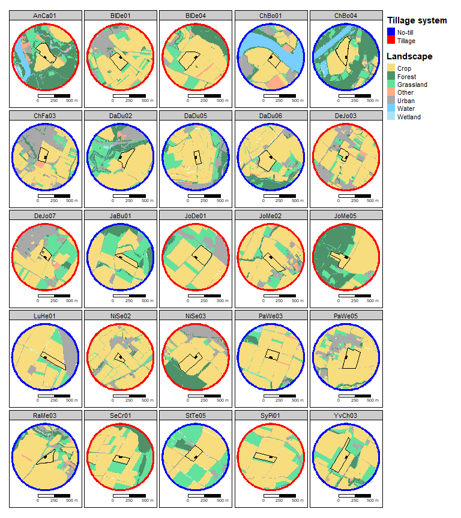
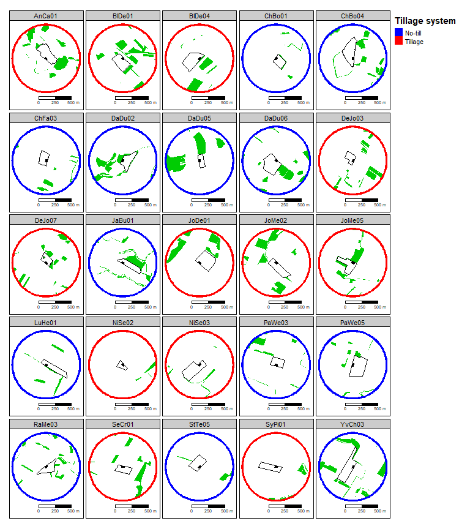
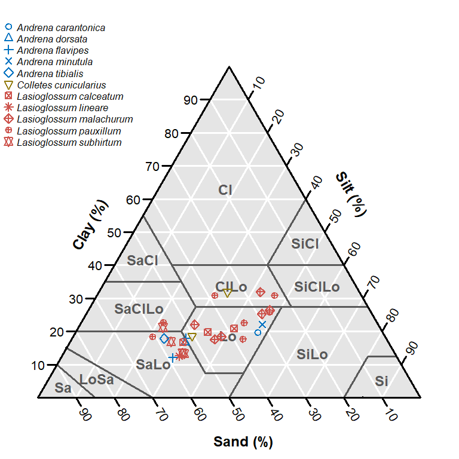
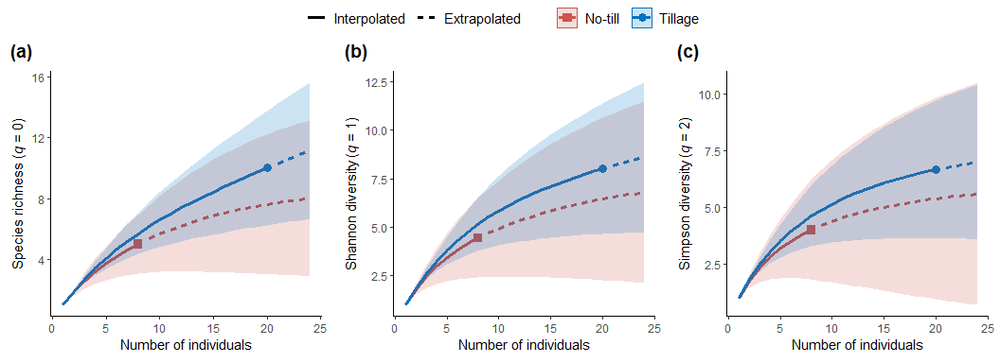

Analysis for Supplementary Information to Tschanz et al. 2022 J Appl
Ecol
================
Philippe Tschanz, Stefan Vogel, Achim Walter, Thomas Keller, Matthias
Albrecht

-   <a href="#1-preliminaries" id="toc-1-preliminaries">1 Preliminaries</a>
    -   <a href="#11-load-data-sets" id="toc-11-load-data-sets">1.1 Load data
        sets</a>
-   <a href="#2-supplementary-analysis" id="toc-2-supplementary-analysis">2
    Supplementary analysis</a>
    -   <a href="#21-species-diversity" id="toc-21-species-diversity">2.1
        Species diversity</a>
    -   <a
        href="#22-effect-of-bare-ground-cover-on-nesting-incidence-and-potential-confounding-with-distance-from-field-edge"
        id="toc-22-effect-of-bare-ground-cover-on-nesting-incidence-and-potential-confounding-with-distance-from-field-edge">2.2
        Effect of bare ground cover on nesting incidence and potential
        confounding with distance from field edge</a>
        -   <a
            href="#221-effects-of-distance-form-field-edge-on-proportion-of-bare-ground"
            id="toc-221-effects-of-distance-form-field-edge-on-proportion-of-bare-ground">2.2.1
            Effects of distance form field edge on proportion of bare ground</a>
        -   <a
            href="#222-effects-of-proportion-of-bare-ground-on-nesting-excluding-data-from-the-two-transects-closest-to-field-edges"
            id="toc-222-effects-of-proportion-of-bare-ground-on-nesting-excluding-data-from-the-two-transects-closest-to-field-edges">2.2.2
            Effects of proportion of bare ground on nesting excluding data from the
            two transects closest to field edges</a>
-   <a href="#3-supplementary-figures" id="toc-3-supplementary-figures">3
    Supplementary figures</a>
    -   <a href="#31-figures-s4-5" id="toc-31-figures-s4-5">3.1 Figures S4-5</a>
    -   <a href="#32-figure-s6" id="toc-32-figure-s6">3.2 Figure S6</a>
    -   <a href="#33-figure-s7" id="toc-33-figure-s7">3.3 Figure S7</a>
-   <a href="#4-supplementary-tables" id="toc-4-supplementary-tables">4
    Supplementary tables</a>
    -   <a href="#41-table-s1" id="toc-41-table-s1">4.1 Table S1</a>
    -   <a href="#42-table-s2" id="toc-42-table-s2">4.2 Table S2</a>
    -   <a href="#43-table-s3" id="toc-43-table-s3">4.3 Table S3</a>

# 1 Preliminaries

``` r
library(iNEXT)
library(soiltexture)
library(tidyverse)
```

    ## ── Attaching packages ─────────────────────────────────────── tidyverse 1.3.2 ──
    ## ✔ ggplot2 3.3.6     ✔ purrr   0.3.4
    ## ✔ tibble  3.1.8     ✔ dplyr   1.0.9
    ## ✔ tidyr   1.2.0     ✔ stringr 1.4.0
    ## ✔ readr   2.1.2     ✔ forcats 0.5.2
    ## ── Conflicts ────────────────────────────────────────── tidyverse_conflicts() ──
    ## ✖ dplyr::filter() masks stats::filter()
    ## ✖ dplyr::lag()    masks stats::lag()

``` r
library(here)
```

    ## here() starts at D:/PhD/Manuscripts/Field Survey/GitHub/Tschanz_et_al_2022_JAppEcol

``` r
library(ggpubr)
library(sf)
```

    ## Linking to GEOS 3.9.1, GDAL 3.4.3, PROJ 7.2.1; sf_use_s2() is TRUE

``` r
library(tmap)
library(lme4)
```

    ## Loading required package: Matrix
    ## 
    ## Attaching package: 'Matrix'
    ## 
    ## The following objects are masked from 'package:tidyr':
    ## 
    ##     expand, pack, unpack

``` r
library(lmerTest)
```

    ## 
    ## Attaching package: 'lmerTest'
    ## 
    ## The following object is masked from 'package:lme4':
    ## 
    ##     lmer
    ## 
    ## The following object is masked from 'package:stats':
    ## 
    ##     step

``` r
# knitr settings
knitr::opts_chunk$set(
  echo = TRUE,
  dev = c("png", "pdf"))

# lists to save results
modlist <- list()
figures <- list()
tables <- list()

# load custom functions
source(here("scripts", "functions.R"))
```

## 1.1 Load data sets

``` r
d.nest <- read_rds(here("data", "nests.rds"))
d.spec <- read_rds(here("data", "species.rds"))
d.field <- read_rds(here("data", "field_level_data.rds"))
d.veg <- read_rds(here("data", "vegetation.rds"))

sf.fields <- st_read(here("data", "geodata.gpkg"), layer = "fields")
```

    ## Reading layer `fields' from data source 
    ##   `D:\PhD\Manuscripts\Field Survey\GitHub\Tschanz_et_al_2022_JAppEcol\data\geodata.gpkg' 
    ##   using driver `GPKG'
    ## Simple feature collection with 25 features and 2 fields
    ## Geometry type: MULTIPOLYGON
    ## Dimension:     XY
    ## Bounding box:  xmin: 2486367 ymin: 1110893 xmax: 2523300 ymax: 1161005
    ## Projected CRS: CH1903+ / LV95

``` r
sf.plots <- st_read(here("data", "geodata.gpkg"), layer = "plots")
```

    ## Reading layer `plots' from data source 
    ##   `D:\PhD\Manuscripts\Field Survey\GitHub\Tschanz_et_al_2022_JAppEcol\data\geodata.gpkg' 
    ##   using driver `GPKG'
    ## Simple feature collection with 25 features and 2 fields
    ## Geometry type: POLYGON
    ## Dimension:     XY
    ## Bounding box:  xmin: 2486492 ymin: 1110952 xmax: 2523060 ymax: 1160964
    ## Projected CRS: CH1903+ / LV95

``` r
sf.plots_buf_500m <- st_read(here("data", "geodata.gpkg"), layer = "plots_buf_500m")
```

    ## Reading layer `plots_buf_500m' from data source 
    ##   `D:\PhD\Manuscripts\Field Survey\GitHub\Tschanz_et_al_2022_JAppEcol\data\geodata.gpkg' 
    ##   using driver `GPKG'
    ## Simple feature collection with 25 features and 2 fields
    ## Geometry type: POLYGON
    ## Dimension:     XY
    ## Bounding box:  xmin: 2486020 ymin: 1110480 xmax: 2523530 ymax: 1161439
    ## Projected CRS: CH1903+ / LV95

``` r
sf.landscape <- st_read(here("data", "geodata.gpkg"), layer = "landscape")
```

    ## Reading layer `landscape' from data source 
    ##   `D:\PhD\Manuscripts\Field Survey\GitHub\Tschanz_et_al_2022_JAppEcol\data\geodata.gpkg' 
    ##   using driver `GPKG'
    ## Simple feature collection with 7 features and 1 field
    ## Geometry type: MULTIPOLYGON
    ## Dimension:     XY
    ## Bounding box:  xmin: 2486020 ymin: 1110480 xmax: 2523530 ymax: 1161439
    ## Projected CRS: CH1903+ / LV95

``` r
sf.bpa <- st_read(here("data", "geodata.gpkg"), layer = "bpa")
```

    ## Reading layer `bpa' from data source 
    ##   `D:\PhD\Manuscripts\Field Survey\GitHub\Tschanz_et_al_2022_JAppEcol\data\geodata.gpkg' 
    ##   using driver `GPKG'
    ## Simple feature collection with 1 feature and 1 field
    ## Geometry type: MULTIPOLYGON
    ## Dimension:     XY
    ## Bounding box:  xmin: 2486157 ymin: 1110681 xmax: 2523497 ymax: 1161345
    ## Projected CRS: CH1903+ / LV95

# 2 Supplementary analysis

## 2.1 Species diversity

We aggregated the bee data over both sampling rounds and per soil
management treatment. Thus, we have $N=2$ assemblages (NT and CT).

Create a list for each soil management type that contains a vector of
the species and their abundance.

``` r
# no-till
ibad_nt <- d.nest %>%
  filter(mngt_soil == "NT", nest_species != "Unknown") %>%
  group_by(nest_species) %>%
  summarize(n = n(), .groups = "drop")

# conventional tillage
ibad_ct <- d.nest %>%
  filter(mngt_soil == "CT", nest_species != "Unknown") %>%
  group_by(nest_species) %>%
  summarize(n = n(), .groups = "drop")

# merged as list with nice names that are used for plotting
modlist$spec$ibad <- list(
  `Tillage` = as.numeric(ibad_ct$n),
  `No-till` = as.numeric(ibad_nt$n))

ibad_nt; ibad_ct
```

    ## # A tibble: 5 × 2
    ##   nest_species                 n
    ##   <fct>                    <int>
    ## 1 Colletes cunicularius        1
    ## 2 Lasioglossum calceatum       1
    ## 3 Lasioglossum leucozonium     1
    ## 4 Lasioglossum pauxillum       3
    ## 5 Lasioglossum subhirtum       2

    ## # A tibble: 10 × 2
    ##    nest_species                n
    ##    <fct>                   <int>
    ##  1 Andrena carantonica         1
    ##  2 Andrena dorsata             1
    ##  3 Andrena flavipes            3
    ##  4 Andrena minutula            1
    ##  5 Andrena tibialis            1
    ##  6 Colletes cunicularius       1
    ##  7 Lasioglossum calceatum      2
    ##  8 Lasioglossum lineare        1
    ##  9 Lasioglossum malachurum     5
    ## 10 Lasioglossum subhirtum      4

We now compute interpolated and extrapolated Hill curves. Note that “For
species richness, the size in the R/E curve can be extrapolated to at
most double or triple the minimum observed sample size, guided by an
estimated asymptote. For Shannon diversity and Simpson diversity, if the
data are not too sparse, the extrapolation can be reliably extended to
infinity to attain the estimated asymptote provided in Chao et
al. (2014).

We therefore compute Hill curves extrapolated to up to three times the
minimum sample size.

``` r
# define iNEXT settings
pt_iNEXT <- function(data, q){
  iNEXT(
    data, datatype = "abundance",
    q = q, nboot = 200, conf = 0.95, knots = 100,
    endpoint = min(sapply(data, sum)) * 3)
}

# compute Hill numbers
modlist$spec$inext <- list()
modlist$spec$inext$q0 <- pt_iNEXT(modlist$spec$ibad, 0)
modlist$spec$inext$q1 <- pt_iNEXT(modlist$spec$ibad, 1)
modlist$spec$inext$q2 <- pt_iNEXT(modlist$spec$ibad, 2)

modlist$spec$inext$all <- pt_iNEXT(modlist$spec$ibad, c(0,1,2))
```

Create figures for different diversity indices:

``` r
lab_div_q0 <- expression("Species richness"~"("*italic(q)~"="~0*")")
lab_div_q1 <- expression("Shannon diversity"~"("*italic(q)~"="~1*")")
lab_div_q2 <- expression("Simpson diversity"~"("*italic(q)~"="~2*")")

figures$fig_s7a <- pt_plot_inext(modlist$spec$inext$q0, lab_div_q0)
figures$fig_s7b <- pt_plot_inext(modlist$spec$inext$q1, lab_div_q1)
figures$fig_s7c <- pt_plot_inext(modlist$spec$inext$q2, lab_div_q2)
```

Compute estimated species richness (Table S4).

``` r
chao <- list()

chao$p0 <- ChaoRichness(modlist$spec$ibad, datatype = "abundance") %>%
  mutate(type = "Species richness")
chao$p1 <- ChaoShannon(modlist$spec$ibad, datatype = "abundance") %>%
  mutate(type = "Shannon diversity") %>%
  rename(Est_s.e. = Est_s.e)
chao$p2 <- ChaoSimpson(modlist$spec$ibad, datatype = "abundance") %>%
  mutate(type = "Simpson diversity")

tables$tab_s4 <- bind_rows(chao) %>%
  mutate(
    mngt_soil = rep(names(modlist$spec$ibad), 3),
    Observed = sprintf("%.2f", Observed),
    Estimator = sprintf("%.2f", Estimator),
    CI = paste0("[", sprintf("%.2f", `95% Lower`), ", ", sprintf("%.2f", `95% Upper`), "]")) %>%
  select(type, mngt_soil, Observed, Estimator, CI)
colnames(tables$tab_s4) <- c("Diversity measure", "Soil management", "Observed", "Estimate", "95% CI")
rownames(tables$tab_s4) <- 1:6
```

## 2.2 Effect of bare ground cover on nesting incidence and potential confounding with distance from field edge

### 2.2.1 Effects of distance form field edge on proportion of bare ground

The distance from field edge was not recorded for vegetation control
plots but is available for nest plots because the nest id is known. We
use this data to test for potential effect of distance from field edge
on proportion of bare ground using a linear mixed-effect model with
proportion of bare ground as response variable and distance from field
edge as explanatory variable. Field was included as random intercept and
slope.

Need to add information on distance from field edge to vegetation data:

``` r
add <- d.nest %>%
  select(nest_id, transect)

# 1m2 scale
d.veg_1m <- d.veg %>%
  left_join(., add, by = "nest_id") %>%
  filter(scale == "1m") %>%
  select(nest_pa, field, transect, sqa_cov_bare) %>%
  mutate(sqa_cov_bare.z = as.numeric(scale(sqa_cov_bare))) %>%
  mutate(dist_m = as.numeric(word(transect, sep = "\\-")))

# 10cm2 scale
d.veg_10cm <- d.veg %>%
  left_join(., add, by = "nest_id") %>%
  filter(scale == "10cm") %>%
  select(nest_pa, field, transect, sqa_cov_bare) %>%
  mutate(sqa_cov_bare.z = as.numeric(scale(sqa_cov_bare))) %>%
  mutate(dist_m = as.numeric(word(transect, sep = "\\-")))
```

No significant effect of distance from field edge on proportion of bare
ground at the 1m2 scale:

``` r
dat <- filter(d.veg_1m, nest_pa == 1, dist_m >= 0)
mod <- lmer(
  sqa_cov_bare ~ dist_m + (dist_m|field),
  data = dat,
  control = lmerControl(optimizer = "bobyqa", optCtrl = list(maxfun = 100000)))
summary(mod, ddf = "Kenward-Roger")
```

    ## Linear mixed model fit by REML. t-tests use Kenward-Roger's method [
    ## lmerModLmerTest]
    ## Formula: sqa_cov_bare ~ dist_m + (dist_m | field)
    ##    Data: dat
    ## Control: lmerControl(optimizer = "bobyqa", optCtrl = list(maxfun = 1e+05))
    ## 
    ## REML criterion at convergence: 730.1
    ## 
    ## Scaled residuals: 
    ##      Min       1Q   Median       3Q      Max 
    ## -2.68495 -0.53372 -0.07752  0.47139  2.22376 
    ## 
    ## Random effects:
    ##  Groups   Name        Variance Std.Dev. Corr
    ##  field    (Intercept) 159.2453 12.6192      
    ##           dist_m        0.3551  0.5959  0.04
    ##  Residual              50.5587  7.1105      
    ## Number of obs: 100, groups:  field, 17
    ## 
    ## Fixed effects:
    ##             Estimate Std. Error      df t value Pr(>|t|)    
    ## (Intercept)  61.7315     3.3746 15.1381  18.293  9.8e-12 ***
    ## dist_m       -0.3162     0.2585  7.3744  -1.223    0.259    
    ## ---
    ## Signif. codes:  0 '***' 0.001 '**' 0.01 '*' 0.05 '.' 0.1 ' ' 1
    ## 
    ## Correlation of Fixed Effects:
    ##        (Intr)
    ## dist_m -0.119

No significant effect of distance from field edge on proportion of bare
ground at the 10cm2 scale:

``` r
dat <- filter(d.veg_10cm, nest_pa == 1, dist_m >= 0)
mod <- lmer(
  sqa_cov_bare ~ dist_m + (dist_m|field),
  data = dat,
  control = lmerControl(optimizer = "bobyqa", optCtrl = list(maxfun = 100000)))
```

    ## boundary (singular) fit: see help('isSingular')

``` r
summary(mod, ddf = "Kenward-Roger")
```

    ## Linear mixed model fit by REML. t-tests use Kenward-Roger's method [
    ## lmerModLmerTest]
    ## Formula: sqa_cov_bare ~ dist_m + (dist_m | field)
    ##    Data: dat
    ## Control: lmerControl(optimizer = "bobyqa", optCtrl = list(maxfun = 1e+05))
    ## 
    ## REML criterion at convergence: 826.2
    ## 
    ## Scaled residuals: 
    ##     Min      1Q  Median      3Q     Max 
    ## -3.4022 -0.3588  0.2405  0.7130  1.2555 
    ## 
    ## Random effects:
    ##  Groups   Name        Variance  Std.Dev. Corr
    ##  field    (Intercept)  12.94595  3.5980      
    ##           dist_m        0.01233  0.1111  1.00
    ##  Residual             219.45412 14.8140      
    ## Number of obs: 100, groups:  field, 17
    ## 
    ## Fixed effects:
    ##             Estimate Std. Error      df t value Pr(>|t|)    
    ## (Intercept)  77.3891     2.3165  9.9586  33.408 1.48e-11 ***
    ## dist_m        0.3292     0.2025  5.3638   1.626    0.161    
    ## ---
    ## Signif. codes:  0 '***' 0.001 '**' 0.01 '*' 0.05 '.' 0.1 ' ' 1
    ## 
    ## Correlation of Fixed Effects:
    ##        (Intr)
    ## dist_m -0.420
    ## optimizer (bobyqa) convergence code: 0 (OK)
    ## boundary (singular) fit: see help('isSingular')

### 2.2.2 Effects of proportion of bare ground on nesting excluding data from the two transects closest to field edges

The following analyses are identical to the ones in the main manuscript
testing for effects of proportion of bare ground on nesting incidence
but excluding data from the two transects closest to field edges to
verify the robustness of the strong effect found in the main manuscript.

Strong effect of proportion of bare ground on nesting incidence at the
1m2 scale:

``` r
dat <- filter(d.veg_1m, dist_m >= 2 | is.na(dist_m))
mod <- glmer(
  nest_pa ~ sqa_cov_bare.z + (1|field),
  data = dat,
  family = binomial(link = "logit"),
  na.action = na.fail,
  glmerControl(optimizer = "bobyqa", optCtrl = list(maxfun = 100000)))
summary(mod)
```

    ## Generalized linear mixed model fit by maximum likelihood (Laplace
    ##   Approximation) [glmerMod]
    ##  Family: binomial  ( logit )
    ## Formula: nest_pa ~ sqa_cov_bare.z + (1 | field)
    ##    Data: dat
    ## Control: glmerControl(optimizer = "bobyqa", optCtrl = list(maxfun = 1e+05))
    ## 
    ##      AIC      BIC   logLik deviance df.resid 
    ##    281.7    294.6   -137.9    275.7      543 
    ## 
    ## Scaled residuals: 
    ##     Min      1Q  Median      3Q     Max 
    ## -0.8464 -0.3077 -0.1811 -0.1102  4.9047 
    ## 
    ## Random effects:
    ##  Groups Name        Variance Std.Dev.
    ##  field  (Intercept) 1.056    1.028   
    ## Number of obs: 546, groups:  field, 25
    ## 
    ## Fixed effects:
    ##                Estimate Std. Error z value Pr(>|z|)    
    ## (Intercept)     -3.1317     0.3877  -8.077 6.62e-16 ***
    ## sqa_cov_bare.z   0.9069     0.2365   3.835 0.000126 ***
    ## ---
    ## Signif. codes:  0 '***' 0.001 '**' 0.01 '*' 0.05 '.' 0.1 ' ' 1
    ## 
    ## Correlation of Fixed Effects:
    ##             (Intr)
    ## sqa_cv_br.z -0.330

``` r
drop1(mod, test = "Chisq")
```

    ## Single term deletions
    ## 
    ## Model:
    ## nest_pa ~ sqa_cov_bare.z + (1 | field)
    ##                npar    AIC   LRT   Pr(Chi)    
    ## <none>              281.74                    
    ## sqa_cov_bare.z    1 295.71 15.97 6.434e-05 ***
    ## ---
    ## Signif. codes:  0 '***' 0.001 '**' 0.01 '*' 0.05 '.' 0.1 ' ' 1

``` r
confint(mod)
```

    ## Computing profile confidence intervals ...

    ##                     2.5 %    97.5 %
    ## .sig01          0.4398899  2.016052
    ## (Intercept)    -4.1385890 -2.506746
    ## sqa_cov_bare.z  0.4609249  1.408477

Strong effect of proportion of bare ground on nesting incidence at the
10cm2 scale:

``` r
dat <- filter(d.veg_10cm, dist_m >= 2 | is.na(dist_m))
mod <- glmer(
  nest_pa ~ sqa_cov_bare.z + (1|field),
  data = dat,
  family = binomial(link = "logit"),
  na.action = na.fail,
  glmerControl(optimizer = "bobyqa", optCtrl = list(maxfun = 100000)))
summary(mod)
```

    ## Generalized linear mixed model fit by maximum likelihood (Laplace
    ##   Approximation) [glmerMod]
    ##  Family: binomial  ( logit )
    ## Formula: nest_pa ~ sqa_cov_bare.z + (1 | field)
    ##    Data: dat
    ## Control: glmerControl(optimizer = "bobyqa", optCtrl = list(maxfun = 1e+05))
    ## 
    ##      AIC      BIC   logLik deviance df.resid 
    ##    238.5    251.4   -116.2    232.5      543 
    ## 
    ## Scaled residuals: 
    ##     Min      1Q  Median      3Q     Max 
    ## -1.3649 -0.2434 -0.1041 -0.0454  6.5903 
    ## 
    ## Random effects:
    ##  Groups Name        Variance Std.Dev.
    ##  field  (Intercept) 1.504    1.226   
    ## Number of obs: 546, groups:  field, 25
    ## 
    ## Fixed effects:
    ##                Estimate Std. Error z value Pr(>|z|)    
    ## (Intercept)     -3.9152     0.5227  -7.491 6.83e-14 ***
    ## sqa_cov_bare.z   1.7999     0.3047   5.907 3.47e-09 ***
    ## ---
    ## Signif. codes:  0 '***' 0.001 '**' 0.01 '*' 0.05 '.' 0.1 ' ' 1
    ## 
    ## Correlation of Fixed Effects:
    ##             (Intr)
    ## sqa_cv_br.z -0.623

``` r
drop1(mod, test = "Chisq")
```

    ## Single term deletions
    ## 
    ## Model:
    ## nest_pa ~ sqa_cov_bare.z + (1 | field)
    ##                npar    AIC    LRT   Pr(Chi)    
    ## <none>              238.49                     
    ## sqa_cov_bare.z    1 295.71 59.225 1.407e-14 ***
    ## ---
    ## Signif. codes:  0 '***' 0.001 '**' 0.01 '*' 0.05 '.' 0.1 ' ' 1

``` r
confint(mod)
```

    ## Computing profile confidence intervals ...

    ##                     2.5 %    97.5 %
    ## .sig01          0.5662748  2.367050
    ## (Intercept)    -5.2152969 -3.060249
    ## sqa_cov_bare.z  1.2542377  2.459317

# 3 Supplementary figures

## 3.1 Figures S4-5

Maps showing landscape data within 500m buffer.

``` r
# clip landscape data to 500m buffer
sf.bpa_clip <- st_intersection(sf.bpa, sf.plots_buf_500m)
```

    ## Warning: attribute variables are assumed to be spatially constant throughout all
    ## geometries

``` r
sf.lct_clip <- st_intersection(sf.landscape, sf.plots_buf_500m)
```

    ## Warning: attribute variables are assumed to be spatially constant throughout all
    ## geometries

``` r
# for nicer plots
plots_buf_outer <- st_buffer(sf.plots_buf_500m, 30) %>%
  mutate(mngt_soil = factor(mngt_soil, levels = c("NT", "CT"), labels = c("No-till", "Tillage")))
plots_buf_inner <- sf.plots_buf_500m
```

``` r
# 500m buffer
map_buffer <- tm_shape(
  plots_buf_outer,
  is.master = TRUE,
  unit = "m") +
  tm_fill(
    col = "mngt_soil",
    palette = c("blue", "red"),
    title = "Tillage system") +
  tm_facets(by = c("field"), ncol = 7) + 
  tm_shape(plots_buf_inner) +
    tm_fill(
      col = "white")

# 50x30m study plots
map_plots <- tm_shape(sf.plots) +
  tm_fill(
    col = "black",
    alpha = 1)

# field boundaries
map_fields <- tm_shape(sf.fields) +
  tm_borders(
    col = "black",
    lwd = 2)

# general style settings
style <- tm_layout(
  legend.title.fontface = 2,
  legend.outside.size = 0.15,
  panel.label.size = 1.5,
  inner.margins = c(0.15,0,0,0) + 0.03)

# scale bar
scale_bar <- tm_scale_bar(breaks = c(0, 250, 500), text.size = 1)
```

``` r
col_lct <- c("#af3700", "#f5d45e", "#227744", "#3CDB84", "#ff996a", "#d2d2d2", "#b40f52", "#55c2ff", "#96dcf2")

# crop, forest, grassland, other, urban, water, wetland
col_lct <- c("#f5d45e", "#227744", "#3CDB84", "#ff996a", "#939393", "#55c2ff", "#96dcf2")

map_lct <- tm_shape(sf.lct_clip) +
  tm_fill(
    col = "class",
    title = "Landscape",
    palette = col_lct,
    alpha = 0.8) +
  tm_facets(by = c("field"), ncol = 5)

map_lct_final <- map_buffer + map_lct + map_fields + map_plots + style + scale_bar
map_lct_final
```

<!-- -->

``` r
map_bpa <- tm_shape(sf.bpa_clip) +
  tm_fill(
    title = "Biodiversity Promotional Area",
    col = "#00cc03") +
  tm_facets(by = c("field"), ncol = 5)

map_bpa_final <- map_buffer + map_bpa + map_fields + map_plots + style + scale_bar
map_bpa_final
```

<!-- -->

## 3.2 Figure S6

Texture triangle showing mean soil texture per species. Note that one
species is not shown (nest id `LuHe01_FIT_2.1`). The soil texture from
this sample was very different from all other soil samples taken in the
same field and its clay content (62%) unrealistic, likely reflecting
some laboratory measurment error. This soil sample was also excluded for
all analyses as mentioned in the main text.

``` r
# prepare data for soilTexture package
dat_tri <- d.spec %>%
  filter(
    !is.na(soil_sand), nest_species != "Unknown", nest_id != "LuHe01_FIT_2.1") %>%
  select(nest_species, soil_sand, soil_silt, soil_clay) %>%
  mutate(
    nest_species = factor(nest_species),
    genus = factor(gsub( " .*$", "", nest_species)))

# layout settings
pt.pch <- 1:20
css.names <- c("soil_clay","soil_silt","soil_sand")
pt.lwd <- 2; pt.cex <- 1.5; pt.col <- c("#0073C2FF", "#8F7700FF", "#CD534CFF")

# triangle plot
base <- TT.plot(
  tri.data = dat_tri,
  tri.sum.tst = FALSE,
  class.sys = "USDA.TT",
  css.names = c("soil_clay","soil_silt","soil_sand"),
  col = pt.col[dat_tri$genus],
  pch = pt.pch[dat_tri$nest_species], cex = pt.cex, lwd = pt.lwd,
  cex.axis = 1.3, font.axis = 1, lwd.axis = 3,
  arrows.show = FALSE,
  class.lab.show = "abr",
  main = "",
  new.mar = c(4, 0, 0, 0))

# to get rid of the arrow, but keep labels (arrows.show = F also removes labels...)
TT.axis.arrows(base, css.lab = c("Clay (%)", "Silt (%)", "Sand (%)"), a.l = c(0.15, 0.45),
    a.h.s = 0.95, a.t.s = 0.13,
    a.t.s2 = -0.0, a.b.s = 0,
    text.tol = NULL, text.sum = NULL, blr.clock = NULL,
    tlr.an = NULL, base.css.ps.lim = NULL, tri.sum.tst = FALSE,
    tri.pos.tst = FALSE, lwd.lab = NULL, arrows.lty = 0,
    col.lab = NULL, font.lab = NULL, cex.lab = NULL,
    family.op = NULL, unit.ps = NULL, unit.tx = NULL,
    lang = NULL)

# legend
legend(
  x = -10, y = 100,
  pch = pt.pch, col = c(rep(pt.col[1], 5), pt.col[2], rep(pt.col[3], 6)), pt.lwd = pt.lwd, pt.cex = pt.cex,
  bty = "n",
  legend = levels(dat_tri$nest_species), text.font = 3)
```

<!-- -->

## 3.3 Figure S7

Impact of tillage system on species diversity.

``` r
plotlist = figures[c("fig_s7a", "fig_s7b", "fig_s7c")]

ggarrange(
  plotlist = plotlist,
  labels = c("(a)", "(b)", "(c)"),
  common.legend = TRUE, nrow = 1)
```

<!-- -->

# 4 Supplementary tables

## 4.1 Table S1

``` r
dat <- d.field$pooled %>%
  select(
    mngt_soil,
    area_ha, alt_plot, slope_plot,
    lsc_BPA_500m, lsc_Forest_500m, lsc_Grassland_500m, lsc_Crop_500m, lsc_Urban_500m)

vars <- dat %>%
  select(-mngt_soil) %>%
  colnames()

# template to save results
table <- data.frame(
  variable = vars,
  summary_nt = NA,
  summary_ct = NA,
  t_stat = NA,
  t_df = NA,
  t_pval = NA,
  mwu_stat = NA,
  mwu_df = NA,
  mwu_pval = NA)

# loop over each variable
for(i in 1:length(vars)){
  var.i <- vars[[i]]
  dat.i <- dat[, c("mngt_soil", var.i)]
  
  # get summary statistics by variable and tillage system
  d.s <- dat.i %>%
    group_by(mngt_soil) %>%
    summarize(
      n = n(),
      mean = mean(.data[[var.i]]),
      min = min(.data[[var.i]]),
      max = max(.data[[var.i]]),
      sd = sd(.data[[var.i]]),
      se = sd / sqrt(n)) %>%
    mutate(
      pretty = paste0(
        sprintf("%.2f", mean), " \u00B1 ", sprintf("%.2f", se),
        " (", sprintf("%.2f", min), " - ", sprintf("%.2f", max), ")"))
  
  table$CT[i] <- filter(d.s, mngt_soil == "CT")$pretty
  table$NT[i] <- filter(d.s, mngt_soil == "NT")$pretty
  form.i <- as.formula(paste0(var.i, "~", "mngt_soil"))
  
  # t-test
  test_t <- t.test(form.i, data = dat.i, alternative = "two.sided")
  table$t_pval[i] <- ifelse(test_t$p.value < 0.001, "<0.001", sprintf("%.3f", test_t$p.value))
  table$t_stat[i] <- sprintf("%.2f", test_t$statistic)
  table$t_df[i] <- sprintf("%.2f", test_t$parameter)
  
  # mann-withney u test
  test_mwu <- wilcox.test(form.i, data = dat.i, exact = FALSE, alternative = "two.sided")
  table$mwu_pval[i] <- ifelse(test_mwu$p.value < 0.001, "<0.001", sprintf("%.3f", test_mwu$p.value))
  table$mwu_stat[i] <- sprintf("%.2f", test_t$statistic)
  table$mwu_df[i] <- sprintf("%.2f", test_t$parameter)
}

# create nicely formated table
table_pretty <- table %>%
  pivot_longer(cols = c(NT, CT), names_to = "tillage_system", values_to = "summary") %>%
  mutate(
    summary = paste0(tillage_system, ": ", summary)) %>%
  select(variable, summary, t_stat, t_df, t_pval, mwu_stat, mwu_df, mwu_pval)
table_pretty
```

    ## # A tibble: 16 × 8
    ##    variable           summary         t_stat t_df  t_pval mwu_s…¹ mwu_df mwu_p…²
    ##    <chr>              <chr>           <chr>  <chr> <chr>  <chr>   <chr>  <chr>  
    ##  1 area_ha            NT: 3.58 ± 0.4… -0.24  22.97 0.809  -0.24   22.97  0.807  
    ##  2 area_ha            CT: 3.43 ± 0.4… -0.24  22.97 0.809  -0.24   22.97  0.807  
    ##  3 alt_plot           NT: 452.05 ± 2… 0.64   22.80 0.526  0.64    22.80  0.265  
    ##  4 alt_plot           CT: 477.65 ± 2… 0.64   22.80 0.526  0.64    22.80  0.265  
    ##  5 slope_plot         NT: 1.96 ± 0.3… -1.02  20.65 0.318  -1.02   20.65  0.497  
    ##  6 slope_plot         CT: 1.59 ± 0.2… -1.02  20.65 0.318  -1.02   20.65  0.497  
    ##  7 lsc_BPA_500m       NT: 6.19 ± 1.0… 0.53   23.00 0.601  0.53    23.00  0.724  
    ##  8 lsc_BPA_500m       CT: 6.97 ± 1.0… 0.53   23.00 0.601  0.53    23.00  0.724  
    ##  9 lsc_Forest_500m    NT: 10.11 ± 3.… 0.51   19.40 0.616  0.51    19.40  0.724  
    ## 10 lsc_Forest_500m    CT: 12.98 ± 4.… 0.51   19.40 0.616  0.51    19.40  0.724  
    ## 11 lsc_Grassland_500m NT: 14.38 ± 2.… -0.07  21.88 0.946  -0.07   21.88  0.765  
    ## 12 lsc_Grassland_500m CT: 14.16 ± 1.… -0.07  21.88 0.946  -0.07   21.88  0.765  
    ## 13 lsc_Crop_500m      NT: 59.47 ± 4.… -0.10  22.38 0.924  -0.10   22.38  0.935  
    ## 14 lsc_Crop_500m      CT: 58.85 ± 4.… -0.10  22.38 0.924  -0.10   22.38  0.935  
    ## 15 lsc_Urban_500m     NT: 11.03 ± 2.… 0.24   22.65 0.815  0.24    22.65  0.849  
    ## 16 lsc_Urban_500m     CT: 11.84 ± 2.… 0.24   22.65 0.815  0.24    22.65  0.849  
    ## # … with abbreviated variable names ¹​mwu_stat, ²​mwu_pval

``` r
#write_csv(table_pretty, file = here("table_s1.csv"))
```

## 4.2 Table S2

See `analysis_manuscript.Rmd`

## 4.3 Table S3

See `analysis_manuscript.Rmd`
